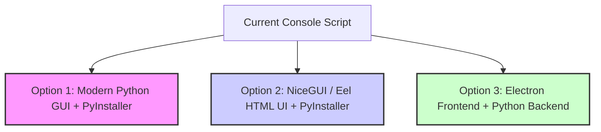

# Guide: Converting the WhatsApp Automation App into a Standalone Desktop Application

This document outlines the architectural approaches, framework options, and step-by-step packaging procedures required to convert your Python-based Google Contacts and WhatsApp automation script into a standalone desktop application (`.exe` for Windows).

---

## Architectural Options

There are three primary approaches to converting your current terminal-based application into a desktop application.



### Option 1: Native Python GUI (Recommended)
This approach wraps your existing logic in a modern Python GUI library and packages it into a single executable.

*   **GUI Framework**: [CustomTkinter](https://github.com/TomSchimansky/CustomTkinter) (a customized wrapper around Tkinter providing dark mode, modern widgets, and a cohesive design) or [Flet](https://flet.dev/) (a Flutter-based Python framework).
*   **Packaging Tool**: PyInstaller.
*   **Pros**:
    *   Single language (100% Python).
    *   Lightweight execution profile.
    *   No complex inter-process communication (IPC) required.
*   **Cons**:
    *   GUI layout is structured in Python code rather than HTML/CSS.

### Option 2: Web-Tech GUI inside Python (NiceGUI / Eel)
This approach allows you to build your user interface using standard web technologies (HTML, CSS, JavaScript) but still write all the backend logic in Python.

*   **GUI Framework**: [NiceGUI](https://nicegui.io/) or [Eel](https://github.com/python-eel/Eel).
*   **Packaging Tool**: PyInstaller.
*   **Pros**:
    *   Full styling flexibility using CSS.
    *   Familiar web layout structure.
*   **Cons**:
    *   Slightly larger memory footprint since it runs a lightweight local server and opens a Chromium window.

### Option 3: Electron Frontend + Python Backend
This approach splits the app into a Node.js Electron frontend and a packaged Python backend executable.

*   **GUI Framework**: Electron (HTML/JS).
*   **Packaging Tool**: Electron Builder + PyInstaller.
*   **Pros**:
    *   Industry standard for desktop web apps (e.g., VS Code, Discord).
*   **Cons**:
    *   High complexity (managing two runtimes, packaging both, handling IPC).
    *   Large final executable size (>150MB).

---

## Implementation Plan (Option 1: CustomTkinter + PyInstaller)

Below is the step-by-step workflow to implement **Option 1**, which offers the highest reliability and easiest maintenance for your existing Python codebase.

### Step 1: Install Required Dependencies
You will need to install the GUI library and the packager:
```bash
pip install customtkinter pyinstaller
```

### Step 2: Create the User Interface Layer
Create a GUI entry point (e.g., `app/gui.py`) that handles inputs, selects the Google Contacts label, shows progress, and triggers the automation in a background thread so the UI does not freeze.

```python
import threading
import customtkinter as ctk
from app.integrations.google_contacts import get_people_service, list_contact_labels

ctk.set_appearance_mode("System")  # Options: "System", "Dark", "Light"
ctk.set_default_color_theme("blue")  # Themes: "blue", "green", "dark-blue"

class App(ctk.CTk):
    def __init__(self):
        super().__init__()
        self.title("WhatsApp Automation Portal")
        self.geometry("600x500")

        # Label Selection
        self.label_title = ctk.CTkLabel(self, text="Select Google Contacts Label", font=ctk.CTkFont(size=16, weight="bold"))
        self.label_title.pack(pady=15)

        self.label_dropdown = ctk.CTkOptionMenu(self, values=["Loading labels..."])
        self.label_dropdown.pack(pady=10)

        # Status & Logs Box
        self.log_textbox = ctk.CTkTextbox(self, width=500, height=200)
        self.log_textbox.pack(pady=15)

        # Start Button
        self.start_button = ctk.CTkButton(self, text="Start Automation", command=self.start_automation_thread)
        self.start_button.pack(pady=15)

        # Load labels in background
        threading.Thread(target=self.load_labels, daemon=True).start()

    def load_labels(self):
        try:
            service = get_people_service()
            self.labels = list_contact_labels(service)
            label_names = [label.get('formattedName', label.get('name', 'Unnamed')) for label in self.labels]
            self.label_dropdown.configure(values=label_names)
            self.label_dropdown.set(label_names[0] if label_names else "No Labels Found")
        except Exception as e:
            self.log(f"Error loading labels: {e}")

    def log(self, text):
        self.log_textbox.insert("end", f"{text}\n")
        self.log_textbox.see("end")

    def start_automation_thread(self):
        self.start_button.configure(state="disabled")
        threading.Thread(target=self.run_automation, daemon=True).start()

    def run_automation(self):
        self.log("Starting automation processes...")
        # Incorporate your existing app.main logic here
        # Update progress in self.log_textbox instead of print statements
        self.start_button.configure(state="normal")

if __name__ == "__main__":
    app = App()
    app.mainloop()
```

> [!IMPORTANT]
> **Thread Safety**: All heavy operations (fetching contacts, running Selenium) must be run inside a Python `threading.Thread`. If run in the main thread, the GUI window will freeze and show as "Not Responding" to the user.

### Step 3: Bundle Static Assets and Configuration
Since the app relies on `.env` and `client_secrets.json`, you must configure PyInstaller to bundle them or read them from the executable's relative path.

Update your paths in `app/config/settings.py` and `app/integrations/google_contacts.py` to support packaged environments:
```python
import sys
import os

def get_base_path():
    if getattr(sys, 'frozen', False):
        # Running in PyInstaller bundle
        return sys._MEIPASS
    else:
        # Running in normal Python environment
        return os.path.abspath(os.path.dirname(os.path.dirname(__file__)))
```

### Step 4: Package with PyInstaller
Run the following packaging command in your terminal:
```powershell
pyinstaller --noconfirm --onedir --windowed --add-data ".env;." --add-data "client_secrets.json;." app/gui.py
```

*   `--onedir`: Creates a single directory containing the `.exe` and all its dynamic libraries. This is recommended because it loads faster than `--onefile` for large GUI dependencies.
*   `--windowed`: Prevents a separate command prompt console window from appearing when the GUI runs.
*   `--add-data`: Copies the config files into the build folder so they are accessible to the executable.

---

## Technical Challenges & Recommendations

### 1. WebDriver Management
In your current code, `webdriver_manager` dynamically downloads and manages Chrome driver binaries:
```python
Service(ChromeDriverManager().install())
```
When compiled into a standalone desktop application, the executable might not have system permissions to write to the default cache directory (`C:\Users\<user>\.wdm`). 

**Recommendation**: Configure a local, relative driver path inside your project directory or bundle the `chromedriver.exe` binary directly in your assets using `--add-data "bin/chromedriver.exe;bin"`.

### 2. Google OAuth Redirects
Currently, your app uses a local web server to complete Google OAuth authorization (`http://localhost:8080/`). This works perfectly on desktop environments since standard browsers can resolve `localhost`.
*   Ensure that you keep `client_secrets.json` in the same directory as the executable.
*   The first launch will pop up the browser for login, generate `data/token.pickle`, and subsequent launches will run without interaction.

### 3. WhatsApp Session Persistence
Your session data is saved inside `whatsapp_session`. When distributing the application:
*   Do not hardcode paths relative to the temporary packaging directory (`sys._MEIPASS`), as that directory is deleted when the app closes.
*   Instead, save the session data in the user's local application data directory:
    ```python
    user_data_dir = os.path.join(os.environ['APPDATA'], 'WhatsAppAutomationPortal')
    ```
