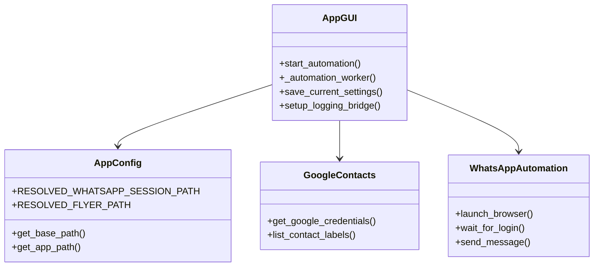

# Walkthrough: Desktop GUI Conversion

I have completed the migration of the WhatsApp student registration automation app from a console-based script to a standalone Windows desktop application (`.exe`).

---

## Changes Implemented

### 1. Requirements & Dependencies
*   Modified `requirements.txt` to add `customtkinter` and `pyinstaller`.
*   Installed both packages on the workspace virtual environment.

### 2. Path Refactoring & Configuration
*   **[app/config/settings.py](file:///c:/xampp/htdocs/DEV-PRI/WHATSAPP/app/config/settings.py)**: Added a dynamic path helper `get_base_path()` and `get_app_path()`. It determines whether the application is running from source or inside a packaged bundle, directing writeable states (`whatsapp_session/`, `data/`) to stable user locations.
*   **[app/services/whatsapp_message_builder.py](file:///c:/xampp/htdocs/DEV-PRI/WHATSAPP/app/services/whatsapp_message_builder.py)**: Shifted Jinja templates directory to use the dynamic `settings.APP_PATH` path resolver.
*   **[app/integrations/google_contacts.py](file:///c:/xampp/htdocs/DEV-PRI/WHATSAPP/app/integrations/google_contacts.py)**: Resolved `client_secrets.json` and output `token.pickle` against settings `BASE_PATH`, auto-creating the parent directory to prevent save exceptions.
*   **[app/integrations/whatsapp_automation.py](file:///c:/xampp/htdocs/DEV-PRI/WHATSAPP/app/integrations/whatsapp_automation.py)**: Switched the local webdriver session configuration to use the resolved user profile folder path.

### 3. Application Dashboard UI
*   **[app/gui.py](file:///c:/xampp/htdocs/DEV-PRI/WHATSAPP/app/gui.py)**: Built a dashboard user interface featuring:
    *   **Settings Form**: Update invite links, flyer paths, and region configurations, writing changes cleanly back to the `.env` file.
    *   **Asynchronous Loader**: Fetches contact groups from Google Contacts on a background thread so the GUI does not freeze.
    *   **Logging Bridge**: Streams all backend logging in real time directly to an interactive GUI terminal.
    *   **Threaded Orchestrator**: Triggers phone number validation and Selenium dispatch in the background, automatically monitoring login state (no more manual keys in the terminal!) and updating progress bars.

---

## Standalone Execution Instructions

The compiled application resides inside:
`c:\xampp\htdocs\DEV-PRI\WHATSAPP\dist\gui\`

To run the application:
1.  Navigate into [dist/gui/](file:///c:/xampp/htdocs/DEV-PRI/WHATSAPP/dist/gui/).
2.  Copy your configuration files into that folder:
    *   Copy `.env` from your project root into `dist/gui/.env`.
    *   Copy `client_secrets.json` from your project root into `dist/gui/client_secrets.json`.
3.  Double-click `gui.exe` to launch the application.

> [!TIP]
> **Portability**: To distribute this application, simply zip the entire `dist/gui/` folder (including the `_internal` directory, `gui.exe`, your `.env`, and `client_secrets.json`) and share the zip. The user can extract and run the `.exe` directly without needing Python or external libraries installed!
